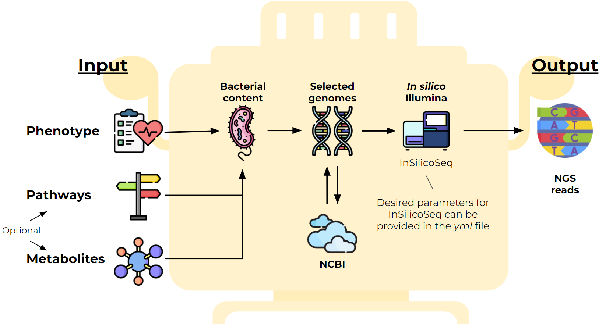

# SAMOVAR: <a href=""></a>  <h3> Simulator of Artificial Metanomes: Organisms and Viruses from Abundances to Reads </h3> 

*Metagenomics* – key approach for biological community analysis. Many new tools appear regularly and their validation becomes the crucial challenge. 


Here we come up with an artificial data generation tool `SAMOVAR` that aims aims to improve algorithms development and accelerate scientific discoveries.
This  pipeline takes the input phenotype or environment as a community property and technical parameters for NGS library to generate `fastq` files with Illumina reads. SAMOVAR performes additional bacteria selection  based on a given *metabolite* or *metabolic pathways*. Overall, our pipeline consists of four steps: 
- Core-bacterial set selection by given phenotype;
- Selection of additional bacteria species based on metabolites and metabolic pathways;
- Prediction of the relative abundance for a selected set of bacteria;
- Illumina reads generation. 


<div style='justify-content: center'>

</div>

### Installation

To get the tool clone the git repository:

```bash
https://github.com/nvaulin/samovar.git
cd samovar
```

Create a `conda/mamba` environment with necessary packages and activate it:

```bash
conda env create -f environment.yml
conda activate samovar
```

### Usage

To run the script, just call it from the directory where the tools is located:

```bash
python Metagenome_generation.py -p [PHENOTYPE] ...
```

Usage options:

```bash
options:
  -h, --help            show this help message and exit
  -p [PHENOTYPE], --phenotype [PHENOTYPE]
                        the base phenotype for metagenome construction ("Health", "HIV", ... )
  -m [METAGENOME_FILE], --metagenome_file [METAGENOME_FILE]
                        read metagenome composition from the file (tsv with species and abundances)
  --pathways [PATHWAYS]
                        read matebolic pathways to account from the file (each pathway on the new line
  --metabolites [METABOLITES]
                        read metabolites pathways to account for
  -c [N_CORE], --n_core [N_CORE]
                        number of core species to leave in metagenome
  -t THREADS, --threads THREADS
                        number of threads (cores)
  --email [EMAIL]       Email address for Entrez requests
  --api_key [API_KEY]   NCBI API key for Entrez requests (if any)
```

### Examples

To perform the test run use the `2_species` phenotype:
```bash
python Metagenome_generation.py -p 2_species
```

With the real baseline phenotypes its better to select *n* core species with the `ncore` (`c`) option. We **HIGHLY recommend always use `ncore` species** when working with real metagenomes. To test the pathways correction use the `example_pathways.txt` file:
```bash
python Metagenome_generation.py -p Health -c 10 --pathways example_pathways.txt
```

To get more information about the particular script, run:

```bash
python Metagenome_generagtion.py  --help
```


### Uninstallation

To uninstall the tool remove the conda environment and delete the cloned folder:
```python
conda remove --name samovar --all
rm -rf samovar
```

### Citation

If you use these tool, please cite as:
- Vaulin N., Chechenina A., Ivanov. A, Ulyantsev V. SAMOVAR: a pipeline for *in silico* generation of metagenomic communities with given properties. Природа, 2023, 443, 27–28

```bibtex
@article{samovar2023,
  title={SAMOVAR: a pipeline for in silico generation of metagenomic communities with given properties},
  author={Vaulin, N. and Chechenina, A. and Ivanov, A. and Ulyantsev, V.},
  journal={Природа},
  year={2023},
  volume={443},
  pages={27--28}
}
```
